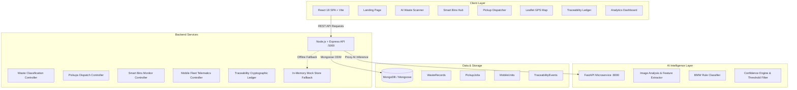

# MEDISORT AI - System Architecture



---

## 1. Core Architectural Principles

1. **Hardware Independence**: Operates with standard smartphone cameras and modern web browsers. No costly IoT bin load cells or RFID readers required for MVP.
2. **Dual-Mode Resiliency**: Every frontend service checks backend availability. If the backend or AI service is offline, the frontend seamlessly transitions to in-browser deterministic mock mode.
3. **Audit & Traceability**: Uses a tamper-evident SHA-256 blockchain-style hash chain (`Hash(CurrentData + PreviousHash)`).
4. **Biomedical Waste Category Standard**:
   - **YELLOW**: Human anatomical, animal, soiled cotton/dressings, expired cytotoxic drugs, chemical waste (incineration/plasma pyrolysis).
   - **RED**: Contaminated recyclable plastic (IV tubing, bottles, catheters, urine bags, gloves) (autoclave/shredding).
   - **WHITE (Translucent)**: Puncture-proof container for sharps (needles, scalpels, blades, needles with fixed syringes) (autoclave + dry heat sterilization / encapsulation).
   - **BLUE**: Contaminated broken glassware, medicine vials, ampoules, metallic body implants (disinfection with sodium hypochlorite + autoclaving/microwaving).

---

## 2. Telematics & Map Simulation
- Mobile units `MS-01`, `MS-02`, `MS-03`, and `MS-04` simulate autonomous routing using coordinate interpolation over OpenStreetMap via Leaflet.
- Waypoint calculations update speed (km/h), battery level, estimated arrival time (ETA), and collection progress.

---

## 3. Cryptographic Proof of Custody
Every state change creates an immutable `TraceabilityEvent`:
```json
{
  "eventId": "EVT-9041",
  "wasteId": "WST-2026-081",
  "action": "PICKUP_COLLECTED",
  "actor": "Driver: Rajesh Kumar (Unit MS-02)",
  "location": "Apollo City Hospital - Ward 3",
  "timestamp": "2026-08-28T16:50:00.000Z",
  "previousHash": "a4f8b9e1c2d3e4f5a6b7c8d9e0f1a2b3c4d5e6f7a8b9c0d1e2f3a4b5c6d7e8f9",
  "hash": "7b8c9d0e1f2a3b4c5d6e7f8a9b0c1d2e3f4a5b6c7d8e9f0a1b2c3d4e5f6a7b8c"
}
```
